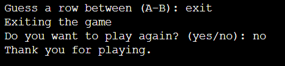
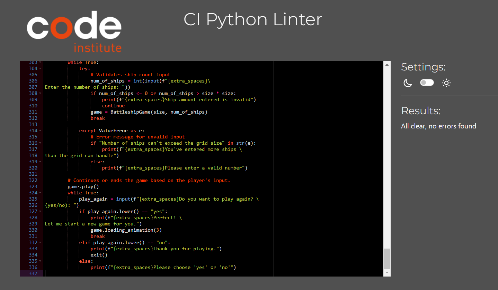

# Battleship Game Readme

Welcome to a thrilling game of Battleship with a twist! In this version,
the playing field features only 1x1 ships, creating an intense and
strategic challenge. [Live version here!](https://iijozzabattleships-8dbba31357c0.herokuapp.com/)

## Table of Contents

1. [**Battleship**](#battleships-game)
   * [How to Play](#how-to-play)
     * [Setup](#setting-up-the-game)
     * [Scoring](#how-to.scoring)
     * [Winning the Game](#winning-the-game)
     * [Exiting the Game](#exiting-the-game)
2. [**User Experience (UX)**](#user-experience-ux)
   * [User Stories](#user-stories)
3. [**Features**](#game-features)
   * [Features Left to Implement](#features-left-to-implement)
4. [**Testing**](#testing)
   * [Testing during development](#testing-during-development)
   * [Bugs Found](#bugs-found)
   * [Functional Testing](#functional-testing)
   * [Validator Testing](#validator-testing)
5. [**Technologies and Libraries Used**](#technologies-and-libraries-used)
6. [**Deployment**](#deployment)
   * [Deploying to Heroku](#to-deploy-to-heroku-terminal)
   * [Deployment to Githubtable of contents](#clone-the-repository-code-from-github-desktop)
7. [**Credits**](#credits)

## How to Play

Battleship is a classic two-player strategy game where the goal is to sink all of your opponent's ships before they sink yours. The game is typically played on a grid, and each player has a set number of ships to place on their grid. In this itteration you play against a computer with an army of 1x1 ships.

### Setup: 

The grids are usually square and can vary in size, but a common grid size is 9x9. In this implementation, you can choose both the size of the grid, up to 9x9 and the amount of ships. The ship are randomly distributed around the grid.

### Scoring:

The game uses a hit/miss system for scoring. Each turn the player guesses a coordiante on where they think a ship might be, hoping to hit the opposing players ship. The player and computer alternate taking turns until someone sinks all of the others ship(s)."

### Winning the Game

The game continues until one player has sunk all of their opponent's ships. In the traditional game, a ship is considered "sunk" when every part of the ship has been hit. 

## Exit the Game

You can exit the game at any point by entering "exit" when prompted for any input.

### Start the Game

Run the Python script provided for this game. You can specify the grid size (e.g., 9x9) and the number of ships you want to play with.

## User Experience (UX)

### User Stories

1. As a player, I want to be able to choose the size of the game grid (from 1x1 to 9x9) so that I can customize the game's difficulty.

2. As a player, I want to specify the number of ships on the grid so that I can control the level of challenge.

3. As a player, I want to see my game board with row and column labels, so I can easily make targeted guesses.

4. As a player, I want to make a guess by specifying a coordinate (e.g., "A3") to hit the opponent's ships.

5. As a player, I want to know if I hit or missed a ship, so I can track my progress.

6. As a player, I want to be informed if I've already guessed a particular spot, so I don't waste turns.

7. As a player, I want to see the opponent's game board, with their ships hidden, so I can plan my moves strategically.

8. As a player, I want the game to notify me when I've sunk all of the opponent's ships, declaring me the winner.

9. As a player, I want the game to switch to the opponent's turn automatically, so I can play against the computer.

10. As a player, I want the computer opponent to make guesses at random, adding a challenge to the game.

11. As a player, I want the game to continue until one side wins, allowing for multiple rounds.

12. As a player, I want to be able to quit the game at any time by typing "exit" to end the session.

13. As a player, I want clear instructions on how to play the game, so I can quickly understand the rules.

14. As a player, I want to have fun and be entertained while playing the game, making it an enjoyable experience.

## Features

**ASCII Art**

Gives the inreoduction screen a bit of flare and retro wibe. Makes the user more inclined to try the game out compared to if it was in plain text.


**Colourful terminal**

Players are greeted by colourful text. Utilizing the colorama library to give the players a more inviting first impression. 

**Interactive Gameplay**

- Players are able to not only choose the gameboard size ranging from 1x1 to 9x9. 
- Players are also able to choose how many ships they want to play with.

**Computer opponent**

Players compete against a computer opponent that targets the game board randomly.

**Replayability**

- Players are able to restart and exit the game anytime by typing exit in the terminal.
- Players will also be given the option to restart or exit when they have either won or lost the game.



**Instructions**

Players are shown clear instructions on how to play the game and how to use the terminal the moment they boot it up. 

**The Grid**

- Players are given a game board which shows exactly where both player and computer have aimed - with clear symbols if they hit or missed their target.
- A small delay between each action makes the gameplay more understandable and in the long run, more enjoyable.

### Features I Want to Implement

- A more colourful board: I wanted each symbol to be a specific colour on the grid.
- Different sized ships: Makes the game more tactical and complex which in turn makes the gamemore fun.
- Player vs Player: Have the option to play against a human opponent.
- Scoreboard: Keep a tally of who has won.
- Make the game more visually appealing.
- Find a way to indent text without repeating code.
- Add exit command in the "Enter the number of ships:" and "Enter the grid size (1-9):" section of the game

## Testing

### Testing during development

* Continuous testing throughout development - Both before and after deployment.
* `print()`and `type()` were used during the development process, to help identify possible errors and bugs.
* All the prompts to the user were tested manually.

### Functional Testing

The game was first developed using the IDE PyCharm and a small amounts of manual testing was carried out before the initial deployment to Heroku. Testing efforts significantly expanded post-deployment on Heroku. Every available input option was rigorously tested across all potential scenarios, with a particular focus on input validation. The player's and computer's boards were carefully observed to detect any modifications resulting from each turn's guesses. Manual testing included thorough examination of invalid imputs and the "exit" functionality on all player prompts.

| Test Case                                                                | Action                                                               | Expected Outcome                                                          | Actual Outcome                                                                       | Pass/Fail | Issues                                                                                                |
| ------------------------------------------------------------------------ | -------------------------------------------------------------------- | ------------------------------------------------------------------------- | ------------------------------------------------------------------------------------ | --------- | ----------------------------------------------------------------------------------------------------- |
| Game Initialization                                                      |                                                                      |                                                                           |
| Start Game                                                               | Clicking the "run program" in Heroku or typing python3 run.py in IDE | Game starts with introduction, ASCII title, and instructions              | Introduced to instructions only and the user have to scroll up to see the ASCII art. | PASS      | NONE                                                                                                  |
| Setting Game Grid Size                                                   |                                                                      |                                                                           |
| Valid Grid Size Input                                                    | Input a number between 1 - 9                                         | Input is accepted and proceeds to generate grid                           | Input is accepted and proceeds to generate grid                                      | PASS      | NONE                                                                                                  |
| Invalid Grid Size Input                                                  | Input a number outside the range 1 - 9                               | Error message displayed and prompted to input valid number                | Error message displayed and prompted to input valid number                           | PASS      | NONE                                                                                                  |
| Non-numeric Input                                                        | Input a non-numeric character (e.g., 'A')                            | Input a non-numeric character (e.g., 'A' or '}')                          | Error message displayed and prompted to input valid number                           | PASS      | NONE                                                                                                  |
| Configuring Ship Quantity                                                |                                                                      |                                                                           |
| Valid Ship quantity input                                                | Place a ship within the grid boundaries                              | Input is accepted and proceeds to generate ships                          | Input is accepted and proceeds to generate ships                                     | PASS      | NONE                                                                                                  |
| Invalid Ship quantity input                                              | Place a ship outside grid or overlapping another ship                | Error message displayed and prompted to input valid number                | Error message displayed and prompted to input valid number                           | PASS      | NONE                                                                                                  |
| Non-numeric Input                                                        | Input a non-numeric character (e.g., 'A')                            | Input a non-numeric character (e.g., 'A' or '}')                          | Error message displayed and prompted to input valid number                           | PASS      | NONE                                                                                                  |
| Gameplay                                                                 |                                                                      |                                                                           |
| Valid Shot Position                                                      | Choose a valid grid position for shot                                | Display 'Hit' or 'Miss' based on shot outcome                             | Display 'Hit' or 'Miss' based on shot outcome                                        | PASS      | NONE                                                                                                  |
| Invalid Shot Position                                                    | Choose a grid position outside boundaries                            | Error message displayed and prompted to choose valid position             | Error message displayed and prompted to choose valid position                        | PASS      | NONE                                                                                                  |
| Repeat Shot Position                                                     | Shoot at a previously chosen position                                | Error message indicating position was already shot at                     | Error message indicating position was already shot at                                | PASS      | NONE                                                                                                  |
| Game End Conditions                                                      |                                                                      |                                                                           |
| Player Wins                                                              | Sink all computer's ships                                            | Display victory message                                                   | Display victory message                                                              | PASS      | NONE                                                                                                  |
| Computer Wins                                                            | All player's ships are sunk by computer                              | Display defeat message                                                    | Display defeat message                                                               | PASS      | NONE                                                                                                  |
| Inputing "Exit" When Configurating Game                                  |                                                                      | Game exits and user prompted with a "Do you want to play again? (yes/no): | Display error message                                                                | FAIL      | The current iteration of the game don't have an exit function implemented in the configuration sstage |
| Inputing "Exit" During Game                                              |                                                                      | Game exits and user prompted with a "Do you want to play again? (yes/no): | Game exits and user prompted with a "Do you want to play again? (yes/no):            | PASS      | NONE                                                                                                  |
| Input "no" During Exit Command                                           | Input 'exit' or 'quit' during any input prompt                       | Game exits immediately                                                    | Game exits immediately                                                               | PASS      | NONE                                                                                                  |
| Input "yes" During Exit Command                                          |                                                                      | Game restarts from the beginning                                          | Game restarts from the beginning                                                     | PASS      | NONE                                                                                                  |
| Invalid Input During Exit command                                        |                                                                      | Error message displayed and user is prompted to try again                 | Error message displayed and user is prompted to try again                            | PASS      | NONE                                                                                                  |
| Inputing "yes" or "no" in a variation of uppercase and lowercase letters | After game ends, choose to play again                                | Input accepted and proceeds to execute the provided command               | Input accepted and proceeds to execute the provided command                          | PASS      | NONE                                                                                                  |
| Visual & Usability                                                       |                                                                      |                                                                           |
| Game Layout and Design                                                   | Observe game interface                                               | Ensure that ASCII art, grid, and messages display correctly               | ASCII art, grid, and messages display correctly                                      | FAIL      | Due to the amount of instructions the ASCII art is pushed up and hidden if the user don't scroll up.  |
| Instructions Clarity                                                     | Read the game's instructions                                         | Instructions should be clear and understandable                           | Instructions are clear and understandable                                            | PASS      | NONE                                                                                                  |

### Bugs Found

* Text not displaying properly - Some text was indented while others not (fixed)
* The players action wasn't displayed on the grid (fixed)
* The player couldn't exit the game on the "Guess a column between ..." (fixed)

### Validator Testing

[CI Python Linter](https://pep8ci.herokuapp.com/) was used for validating the python files.  No errors reported.



## Technologies and Libraries Used

* The game logic was implemented using Python as the programming language.

* [Colorama](https://pypi.org/project/colorama/) was installed and imported for adding color to text to make it easier to read.
* [Pyfiglet](https://pypi.org/project/pyfiglet/0.7/) was installed and imported for adding ascii art to the game title.
* [GitHub](https://github.com/) has been used to store the code, images, and other content related to the project.
* [Heroku](https://dashboard.heroku.com/apps) was used to deploy the game on the web.
* [Git](https://git-scm.com/) was used to commit and push code during the development stage.
* [Codeanywhere](https://app.codeanywhere.com/) was used as an IDE.
* [Pycharm](https://www.jetbrains.com/pycharm/nextversion/) was used as an IDE during early stages of development.

## Deployment

The site was deployed via [Heroku](https://id.heroku.com/login).
This project was developed utilizing the [Code Institute Template](https://github.com/Code-Institute-Org/p3-template).

`pip freeze > requirements.txt` was used to add pyfiglet and Colorama imports to Heroku for deployment.

### Deploying to Heroku

This guide will walk you through deploying a Python web application to Heroku using the Heroku Dashboard. It doesn't require a command-line interface (CLI). Make sure you have a Heroku account and Git installed on your local machine.

#### Step 1: Prerequisites

- Create a Heroku account at [Heroku's website](https://www.heroku.com/).
- Ensure you have Git installed on your local machine.

#### Step 2: Prepare Your Python Application

- Ensure your Python application is properly set up.
- Create a `requirements.txt` file listing your project's dependencies.
- Include a `Procfile` that tells Heroku how to run your application.

#### Step 3: Deploy Your Application

- Initialize a Git repository for your project if it's not already one:

   ```sh
   git init
   git add .
   git commit -m "Initial commit"

- Install the Heroku CLI if you prefer a command-line interface.
   
#### Step 4: Create and Deploy on Heroku

1. Log in to your Heroku account through the Heroku website.

2. Click the "New" button in the Heroku dashboard and select "Create New App."

3. Give your app a unique name. This name will be a part of your app's URL, so choose wisely. You can also choose a region that's geographically closer to your target audience for better performance.

4. In the "Deploy" tab of your app's dashboard, you have options to connect your GitHub repository or deploy using a Git repository. Choose the one that suits your project. If you're connecting a Git repository, make sure your project is already hosted on Git.

5. If you're using a Git repository, you can enable automatic deploys. This means your app will be automatically redeployed every time you push changes to your Git repository. This is a convenient option for continuous deployment.

6. Finally, deploy your app by clicking the "Deploy Branch" button. Heroku will start building your application. You can see the build progress in the activity tab. Once the build is complete, your application is live.

#### Step 5: Open Your App

1. After your deployment is successful, you can open your app by clicking the "Open App" button in your Heroku dashboard.

2. Heroku will open your application in a new tab. You can also access it directly via the URL provided (e.g., `https://your-app-name.herokuapp.com`).

### Deployment to Github

- The site was deployed to GitHub pages. The steps to deploy are as follows:
  - In the GitHub repository, navigate to the Settings tab
  - From the menu on left select 'Pages'
  - From the source section drop-down menu, select the Branch: main
  - Click 'Save'
  - A live link will be displayed in a green banner when published successfully.

#### Clone the Repository Code Locally

Navigate to the GitHub Repository you want to clone to use locally:

- Click on the code drop down button
- Click on HTTPS
- Copy the repository link to the clipboard
- Open your IDE of choice (git must be installed for the next steps)
- Type git clone copied-git-url into the IDE terminal

The project will now have been cloned on your local machine for use.

## Acknowledgements

- I would like to thank Carolina Leguizamon for helping me kickstart the project, giving me ideas and general encouragement throughout the project. Was a huge help keeping me level-headed and continue coding when times were tough.


